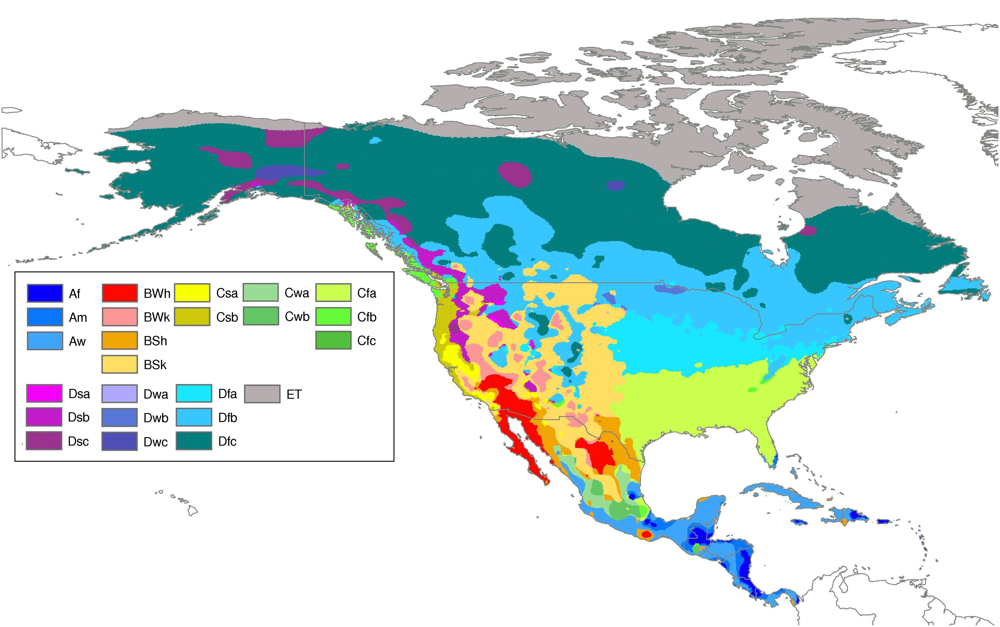

# Methodology and results

## Extreme Clustering

The first analysis consisted of a modification of a clustering technique - partition around medoids - used in @brackenSpatialVariabilitySeasonal2015.

3,000 case studies were randomly sampled from the selected data to alleviate the simulation. The structural condition time series and the lat, long position of the sample was the only variables provided. A range from 2 to 20 clusters was analyzed. Figures \@ref(fig:pam-2cluster) and \@ref(fig:pam-6cluster) show the optimal and third-best performance according to the average silhouette method reproduced in figure \@ref(fig:pam-silh).

```{r pam-silh, fig.cap='Average silhouete profile for each number of clusters', out.width='80%', fig.align='center', echo=FALSE, warning=FALSE, message=FALSE}
load("pam.RData")
p_sil = qplot(ks,sil)+
  geom_abline(aes(intercept=min(sil)),slope=0)+
  xlab('Number of clusters')+
  ylab('Silhouette')+
  theme_minimal()
print(p_sil)
```
```{r pam-2cluster, fig.cap='Optimal PAM 2 - Clusters', out.width='80%', fig.align='center', echo=FALSE, warning=FALSE, message=FALSE}
clusters = cbind(ll,cluster=cluster_list[[which(ks==optimal_k)]]$clustering)

ggplot() +
  geom_polygon( data=map_data("state"), 
                aes(x=long, y=lat, group = group),
                colour="black",fill="lightgrey") +
  geom_point(data = clusters,aes(x = ll$LONG_017,y = ll$LAT_016,
                           color = factor(cluster))) + 
  scale_color_manual(values =rev(brewer.pal(optimal_k,"RdYlBu"))) +
  coord_map("lambert", parameters = c(30, 0),
            xlim = c(-125,-70)) +
  theme_minimal()

```
```{r pam-6cluster, fig.cap='Sub-optimal PAM 5 - Clusters', out.width='80%', fig.align='center', echo=FALSE, warning=FALSE, message=FALSE}
fixed_k = 6
clusters = cbind(ll,cluster=cluster_list[[which(ks==fixed_k)]]$clustering)

ggplot() +
  geom_polygon( data=map_data("state"), 
                aes(x=long, y=lat, group = group),
                colour="black",fill="lightgrey") +
  geom_point(data = clusters,aes(x = ll$LONG_017,y = ll$LAT_016,
                           color = factor(cluster))) + 
  scale_color_manual(values =rev(brewer.pal(fixed_k,"RdYlBu"))) +
  coord_map("lambert", parameters = c(30, 0),
            xlim = c(-125,-70)) +
  theme_minimal()

```

The similarity between the pattern showed by the 6-cluster simulation and the North American Climate zones/types made us reflect about a potential connection. That is why new variables associated with monthly extreme temperatures and annual precipitation were added as covariates.



### Adding climate variables to bridge location

Monthly climate-division data from the National Centers for Environmental Information [@voseImprovedHistoricalTemperature2014] was collected for the period 1991-2017. For each of the 344 datapoints scatterd throughout the Continental US, the anual monthly maximum and minimum temperature and annual precipitation was aggregated.

To translate this information into bridge-located data, a local polynomial regression with a low alpha (0.05) and linear degree was used for each climate variable. Fig

```{r clim-reg, fig.cap='1992 Annual maximum temperature - nClimDiv data and locfit regression', out.width='80%', fig.align='center', echo=FALSE, warning=FALSE, message=FALSE}
load("climate.RData")
ggplot() +
  geom_polygon( data=map_data("state"), 
                aes(x=long, y=lat, group = group),
                colour="black",fill="lightgrey") +
  geom_point(data = data.plot,aes(x = lon,
                           y = lat,colour = tmax,shape = 24,fill = tmax)) + 
  scale_shape_identity(aes(colour = tmax, shape = 24)) +
  scale_color_gradientn(colours =rev(brewer.pal(5,"RdYlBu"))) +
  scale_fill_gradientn(colours =rev(brewer.pal(5,"RdYlBu"))) +
    coord_map("lambert", parameters = c(30, 0)) +
  theme_minimal() + 
  geom_point(data = clim.data,aes(colour=tmax,
                 x=lon,y=lat))

```

## Principal Component Analysis

A second analysis was carried out using PCA. In this case all variables with exception of the deficiency condition of the bridge were considered in the simulation. As a first approach, the climate variables were not included (Fig. \@ref(fig:lambdas)). Repeating the process with tmax, tmin, and prec lead to a greater explanation of the variance in firsts four PC (see fig. \@ref(fig:lambdas-clim)).

```{r lambdas, fig.cap='Variance explained by each PC', out.width='80%', fig.align='center', echo=FALSE, warning=FALSE, message=FALSE}
load("PCA.RData")
ggplot()+
  geom_line(data=data.frame(lambdas),aes(x=1:length(lambdas),y=lambdas)) +
  labs(x="PC",y="Variance explained by the PC") +
  theme(legend.position=c(0.9,0.9))
```

```{r lambdas-clim, fig.cap='Variance explained by each PC, including climate variables', out.width='80%', fig.align='center', echo=FALSE, warning=FALSE, message=FALSE}

load("PCA.Clim.RData")
ggplot()+
  geom_line(data=data.frame(lambdas),aes(x=1:length(lambdas),y=lambdas)) +
  labs(x="PC Number",y="Variance explained by the PC") +
  theme(legend.position=c(0.9,0.9))
```

With the second analysis (climate - considered), the influence of each eigenvector on the attributes of our dataset was plotted and analyzed (fig. \@ref(fig:eigen))

```{r eigen, fig.cap='Influence of eigenvector on each attribute', out.width='100%', fig.align='center', echo=FALSE, warning=FALSE, message=FALSE}
par(las=2) # horizontal y - axis label
par(mar=c(4,12,4,4)) # increase y-axis margin.
par(mfrow=c(2,2))
for(i in 1:4){ # plot the four eigenvectors against each attribute
  or = sort(abs(zsvd$u[,i]),index.return = TRUE)
  barplot(zsvd$u[or$ix,i],main=paste("Eigenvector",i,"influence"),names.arg = colnames(xx)[or$ix],horiz=TRUE,cex.names=0.8)
  indexmax=sort(abs(zsvd$u[,i]),decreasing = TRUE,index.return = TRUE) # sort eigen by largest values 
}

```

### Multinomial regression

The first 4 PC were used to fit a multinomial regression on the structural condition of the bridge, as they represent almost 60% of the variance of the model. The best model using step AIC criteria was the one including all four PC as covariates.

Two statistics were calculated to assess the accuracy of the regression. First, the ranked probability score for the model without climate variables was of 7.5 %. That is, the increase in the accuracy by predicting through the model instead of the count based probabilities was of 7.5 %. The introduction of the climate variables (tmax, tmin, prec) increased the ranked probability score skill from 7.5 % to 8.6 %.

Additionally, a confusion matrix `caret::confusionMatrix` was calculated to evaluate the "false positives" and "false negatives" the model predicted. The output shown below evidences how hard it is for the model to be accurate, as the number of "false 1 identified as such" (structurally deficient) is similar to non identified "true 1". Only a small fraction of "true 1" are identified correctly.

```{r confusion, tidy=TRUE, echo=FALSE, warning=FALSE, message=FALSE}
load("confusion.rds")
  confusion$table
```

## Self Organizing Maps

As an alternative to the previous machine learning techniques, a 3 by 3 node SOM clustering has been carried out. Figure \@ref(fig:som-plot) the weight of each attribute on each of the 9 nodes. The resulting distribution aggregates statistically closer bridges in the same nodes, with a potential for better accuracy in the regression of each separately. 

```{r som-plot, fig.cap='Attribute (code) signal on each node', out.width='100%', fig.align='center', echo=FALSE, warning=FALSE, message=FALSE}  
load("som.rds")
plot(som.nbi)
```

To better explain this approach, two properties from the ensemble, the design load knowledge and the reconstruction effect, will be plotted. Figure \@ref(fig:som-prop1) shows the strong signal of the design load variable on the red node. Similarly, the comparative relevance of bridges on an specific node related to the binary variable "reconstruction" is plotted in figure \@ref(fig:som-prop2). 

```{r som-prop1, fig.cap='Property plot for "Design load" binary variable', out.width='80%', fig.align='center', echo=FALSE, warning=FALSE, message=FALSE}  
# coolBlueHotRed <- function(n, alpha = 1) {rainbow(n, end=4/6, alpha=alpha)[n:1]}
brewer = function(n,name = "RdYlBu"){brewer.pal(n,name=name)[n:1]}
par(mfrow = c(1, 1))
plot(som.nbi, type = "property", 
     property = som.nbi$codes[[1]][,4], main=colnames(som.nbi$data[[1]])[4],
     palette.name=brewer)
```
```{r som-prop2, fig.cap='Property plot for "Reconstruction" binary variable' , out.width='80%', fig.align='center', echo=FALSE, warning=FALSE, message=FALSE}
plot(som.nbi, type = "property", 
     property = som.nbi$codes[[1]][,10], main=colnames(som.nbi$data[[1]])[10],
     palette.name=brewer)
```

Alternatively, a hierarchical clustering could be carried out on the map to obtain fewer number of nodes and reduce regression models. As an example, a k-means with 4 clusters on the nodes is showed in figure \@ref(fig:som-cluster).

```{r som-cluster, fig.cap='Hierarchical K-means clustering on SOM', out.width='100%', fig.align='center', echo=FALSE, warning=FALSE, message=FALSE}
mydata <- som.nbi$codes[[1]] 
wss <- (nrow(mydata)-1)*sum(apply(mydata,2,var)) 
for (i in 2:8) {
  wss[i] <- sum(kmeans(mydata, centers=i)$withinss)
}
# plot(wss)

som_cluster <- cutree(hclust(dist(som.nbi$codes[[1]])), 4)
plot(som.nbi, type="codes", bgcol = brewer(4)[som_cluster], 
     main = "K-Means Clusters") 
add.cluster.boundaries(som.nbi, som_cluster)
```
